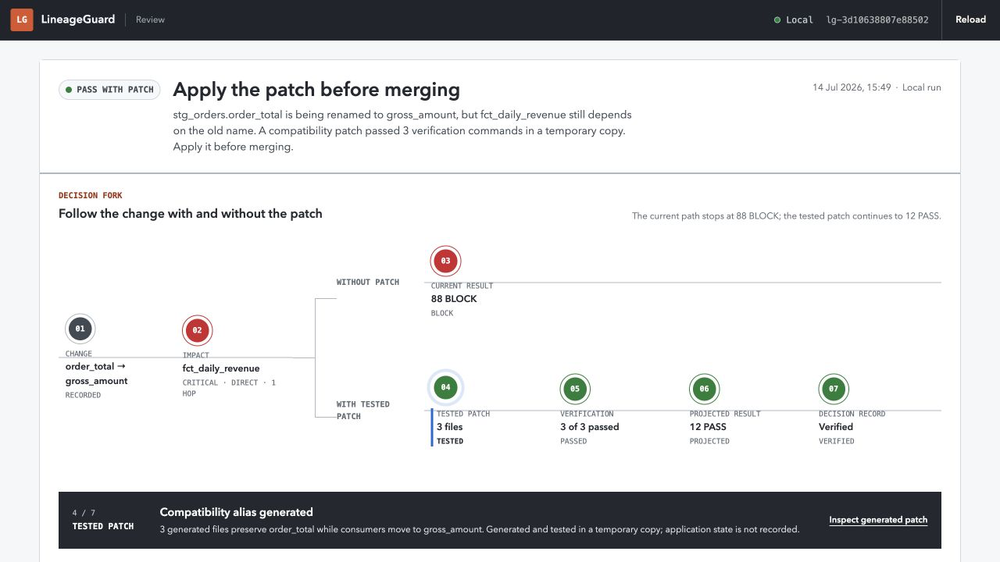
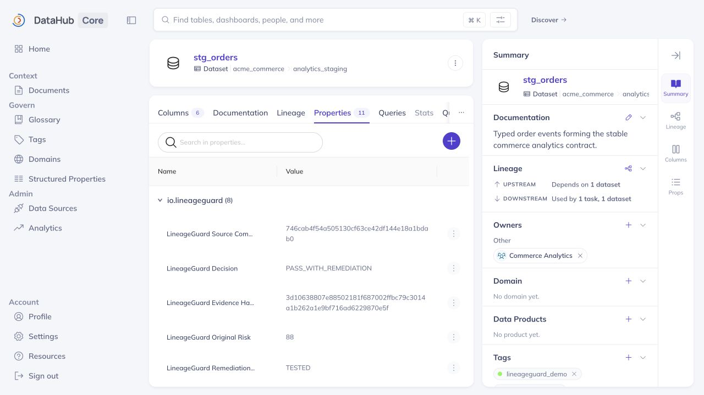
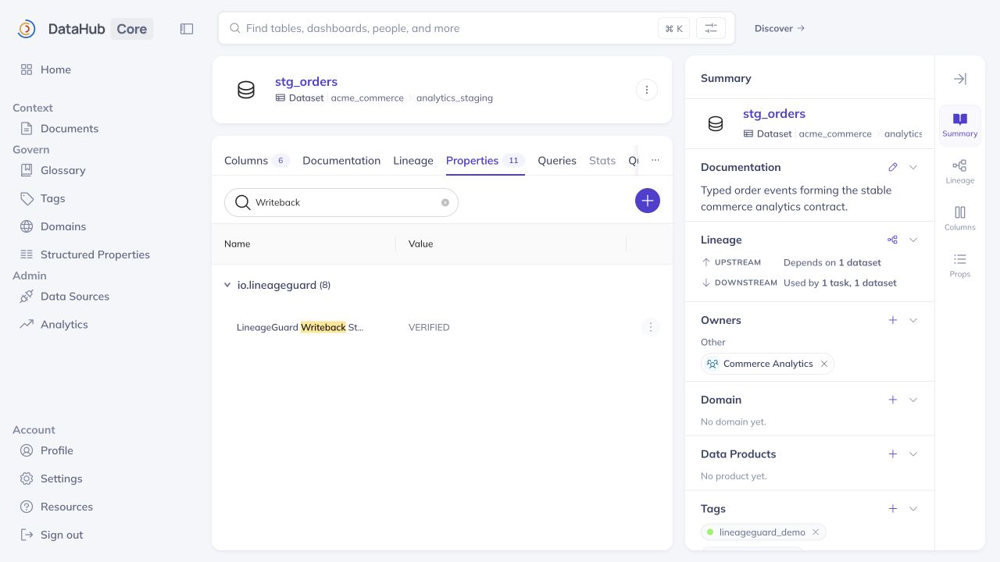
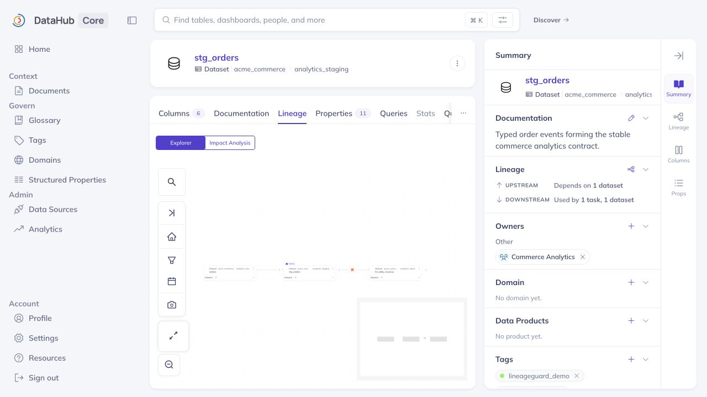

# LineageGuard PR Agent

> Before a schema PR breaks Monday's dashboard, LineageGuard finds the
> cataloged consumers within an explicit lineage bound, builds and tests the
> migration bridge, and leaves a verifiable change passport in DataHub.

LineageGuard is a provider-agnostic CLI PR gate for compiled dbt schema changes.
It uses **DataHub Core** through the **official DataHub MCP Server** to trace
column-level blast radius across downstream datasets and enrich those results
with owners and governance evidence. A narrow GraphQL gap adapter retrieves native
DataHub Assertion definitions that the pinned stable MCP release does not
expose. It then scores the proposed change, generates a bounded compatibility
patch, runs it in an isolated dbt/DuckDB project, rescans the compiled future
schema, and writes the decision back into DataHub with MCP readback proof.

The distinguishing loop is counterfactual:

```text
proposed rename
  -> DataHub-grounded high-risk BLOCK
  -> generated compatibility alias + deprecation metadata + equality test
  -> fresh dbt seed / parse / build
  -> compiled-manifest comparison proves the old interface remains
  -> residual additive change rescored to PASS
  -> PASS_WITH_REMEDIATION passport written to and read back from DataHub
```

Catalog lineage, risk, test results, and writeback state come only from
recorded deterministic evidence. The gate fails closed when critical evidence
is missing.

This is a personal hackathon entry by Lewis McGuire, the sole entrant.

## Why DataHub is essential

LineageGuard does not treat DataHub as a search box or presentation layer.

- `search` and `list_schema_fields` bind the proposed dbt relation and column
  to the catalog baseline; returned dataset identity and schema-page arithmetic
  must match the exact request.
- `get_lineage` traverses downstream column lineage to three hops. The client
  validates GraphQL totals and fails closed when the pinned MCP's 100-result
  exhaustive window cannot prove complete coverage.
- `get_entities` enriches the returned lineage assets with owners and tags. The
  synthetic catalog also contains a related dbt job, chart, and dashboard for
  DataHub-side inspection; the retained run does not count those as scored
  impacted assets.
- A narrow read-only GraphQL adapter retrieves DataHub Assertion entities that
  are not exposed by the pinned stable MCP release.
- `add_structured_properties`, `add_tags`, and `save_document` persist the
  final decision, scores, test state, evidence hash, source commit, and human-readable
  change passport.
- Dataset `relatedDocuments` from `get_entities` proves the passport relation;
  an exact anchored `grep_documents` read proves its title and full content on
  open-source Core.
- Writeback first records `PENDING` machine state and the neutral document.
  Only after entity-bound readback succeeds does it replace stale decision
  tags and add the current tag. That tag reads back while state is still
  `PENDING`; only then is state set to `VERIFIED` and read back again. Any gap
  remains `WRITEBACK_PENDING`.

The client discovers server capabilities at startup and refuses to silently
downgrade if required official MCP tools are absent.

## The Acme demo

The checked-in scenario is synthetic and safe to publish:

- a green dbt/DuckDB commerce project with a contracted `order_total` column;
- a proposed PR that renames it to `gross_amount` without migrating consumers;
- a seeded finance mart, dbt flow/job, chart, executive dashboard, owners,
  tags, column lineage, and native DataHub not-null assertion; the retained
  scored blast radius is the finance mart, its owner, and assertion evidence;
- a deterministic, idempotent official-SDK metadata UPSERT plan;
- an expected failing unremediated dbt build;
- a generated three-file bridge that passes a fresh isolated build; and
- a sanitized compiled-manifest snapshot used for residual-risk proof.

The application never uses mock DataHub responses in the demo path. Test
doubles exist only in unit tests.

## See the result first

Judges can inspect the sealed, checked-in run without starting the 13 GB
DataHub stack:

```bash
uv sync --extra dev --frozen
LINEAGEGUARD_RUN_ARTIFACT=examples/generated/report.json make serve
# http://127.0.0.1:8765
```

This is a read-only evidence preview, not a substitute for the live demo. The
artifact schema and integrity seal are revalidated by the same review app.

## Quick start

Requirements:

- macOS or Linux with Docker Desktop/Engine, Docker Compose v2, and `lsof`;
- a local Unix-socket Docker context, at least 2 CPUs, 8 GB Docker memory,
  swap support, and approximately 13 GB free host and Docker disk for DataHub;
- Python 3.12 or 3.13 and [`uv`](https://docs.astral.sh/uv/).

Install and verify the application:

```bash
uv sync --all-extras --frozen
make check
make test-integration
```

Start DataHub Core and create the local-only structured properties:

```bash
make datahub-preflight
make datahub-up
make test-datahub
```

`make datahub-up` downloads the official DataHub Core `v1.6.0` Compose source,
checks its pinned SHA-256, rewrites all six published ports to fixed IPv4
loopback mappings, and reconciles the running project from that canonical
file. It rejects remote Docker contexts, host networking, unexpected service
images, remapped ports, and a modified cached Compose file before using a
login or token.

It creates a one-month local PAT without printing it, stores it at
`.lineageguard/datahub-token` with owner-only permissions, and upserts the
LineageGuard property definitions. On first creation it asks for the local
quickstart password using a hidden terminal prompt. The official quickstart
default is username `datahub` and password `datahub`; use the credentials you
configured if you changed them. Non-interactive runs can set
`DATAHUB_LOCAL_USERNAME` and `DATAHUB_LOCAL_PASSWORD` in the process environment.
The login password is never stored. The official local Core has GMS bearer
authentication disabled, so token reuse is reported honestly as
`REUSED_UNVERIFIABLE`, not as proof that the PAT was accepted. Only a definitive
authentication rejection rotates it; transient or unverifiable results preserve
the existing file. Token creation is locked, and a newly minted token is revoked
if its private file cannot be stored. The token is ignored by Git.

`make test-datahub` is the retained automated smoke proof for real Core, MCP
mutations, and MCP readback. Run the complete synthetic demo, including explicit
local MCP writeback:

```bash
make demo
```

Then open the read-only change flight recorder:

```bash
make serve
# http://127.0.0.1:8765
```

The UI validates `.lineageguard/runs/latest.json` against the typed run schema
and recomputes its artifact integrity seal before serving it. It has honest
empty, invalid, oversized, and writeback-pending states and never embeds staged
demo data in application code.

## Analyze another dbt change

LineageGuard compares compiled dbt manifests so it can distinguish an actual
rename from unrelated remove/add operations. Automatic repair is intentionally
narrow: one high-confidence column rename whose model projection is a direct
column or direct cast.

```bash
uv run lineageguard analyze \
  --before-manifest path/to/base/target/manifest.json \
  --after-manifest path/to/pr/target/manifest.json \
  --project-dir path/to/pr \
  --model-path models/staging/stg_orders.sql \
  --schema-path models/staging/schema.yml \
  --test-path tests/lineageguard_order_total_matches_gross_amount.sql \
  --model-name stg_orders \
  --selector 'stg_orders+' \
  --writeback
```

Omit `--writeback` for a read-only run. Add `--fail-on-nonpass` in a PR gate to
exit with code 2 unless the decision passes, the run is `COMPLETE`, and any
requested writeback was read back as `VERIFIED`.

## Risk and trust model

The versioned policy is transparent:

```text
asset score = clamp(worst change severity + catalog signals
                    - 4 * downstream hops after the first, 0, 100)
breadth     = min(15, round_half_up(3 * log2(1 + unique assets)))
overall     = clamp(max asset score + breadth, 0, 100)
```

Thresholds are `PASS 0–24`, `REVIEW 25–59`, and `BLOCK 60–100`.
Incomplete catalog, lineage, traversal, ownership, or assertion evidence adds
an explicit minimum `REVIEW`; it never lowers the numeric score.

Other safety boundaries:

- DataHub text and metadata are never executed.
- Generated files must match an exact path allowlist and cannot traverse or
  write through symlinks.
- Verification copies a trusted/reviewed dbt project into a temporary workspace,
  rejects symlinks, strips credentials, uses `shell=False`, permits only fixed
  dbt commands, bounds retained output, and enforces timeouts. Version 0.1 is
  not an OS sandbox for hostile fork code.
- Raw compiled SQL is not retained in counterfactual snapshots. Ordered and
  quoted projection identity, full model configuration, column constraints,
  compiled attached-test semantics, and non-projection query context become
  SHA-256-backed evidence. The old physical ordinal must stay fixed and only
  the intended replacement column may be appended. Model-level constraints and
  every compiled model/singular test must also survive; the generated equality
  test is the only allowed additional proof.
- MCP reads retry; mutations do not retry because their effects may be
  ambiguous.
- Git provenance names a source commit only for a clean tracked source tree;
  otherwise it records `WORKTREE`. Supplied or in-process-generated manifests
  are labelled separately and bound by SHA-256, never represented as files that
  the source commit contained.
- A local report is not represented as durable DataHub state until MCP
  readback matches the required machine fields, tag, scores, and document
  identity.

See [the architecture](docs/architecture.md) and
[security model](docs/security.md) for the full trust boundary. The pinned
[DataHub capability matrix](docs/research/datahub-capability-matrix.md) records
the exact MCP/GraphQL split and known lineage-window limitation.

## Verification status

Verified locally on 2026-07-14:

- Ruff, formatting, strict mypy, and the unit coverage gate pass;
- 528 offline unit tests pass and the 85% branch-aware coverage gate passes;
- all three real dbt/DuckDB integration tests pass;
- the real dbt/DuckDB baseline builds successfully;
- the unremediated proposal fails on the removed interface as expected;
- the generated compatibility bridge passes dbt seed, parse, and build;
- the compiled counterfactual preserves `order_total` and leaves only the
  required additive `gross_amount` change, which scores 12/100 (`PASS`);
- the local quickstart preserves an existing owner-only PAT without printing it
  and reports reuse as `REUSED_UNVERIFIABLE` while local bearer enforcement is
  disabled;
- `make test-datahub` passes against pinned DataHub Core `v1.6.0` with real
  official-MCP mutations and independent readback;
- `make demo` seeds the deterministic synthetic catalog and finishes `COMPLETE`,
  `PASS_WITH_REMEDIATION`, with DataHub writeback `VERIFIED`;
- the release verifier validates all eight retained evidence hashes and all
  four PNG signatures; and
- the current wheel and sdist each install independently under Python 3.12 and
  3.13, and all four isolated installs report version `0.1.0`.

The sealed, sanitized output from clean run `lg-3d10638807e88502` is retained in
[`examples/generated`](examples/generated/README.md). Its recorded source
identifier is `746cab4f54a505130cf63ce42df144e18a1bdab0` from the clean
pre-publication run; its generated manifests are labelled separately and bound
by SHA-256.

The matching local report and DataHub durable-state and column-lineage views
were captured and audited without credentials, personal identity, or local
filesystem paths:









The README quickstart was repeated from a fresh detached checkout of the sealed
pre-publication package snapshot. The wheel and sdist were then rebuilt from
that checkout, verified, checksummed, and installed independently under Python
3.12 and 3.13.
All four isolated installs reported their CLI version.

The screenshots are supporting visual evidence from the same local demo state;
the sealed machine-readable report remains authoritative.

## Project map

```text
src/lineageguard/
  agent.py                 closed-loop orchestration
  changes/                 dbt manifest and ALTER TABLE parsing
  datahub/                 MCP, GraphQL, seed, token, writeback adapters
  remediation/             bounded generation, temp-copy verification, rescore
  review_ui/               local FastAPI change flight recorder
  risk/                    versioned deterministic policy
demo/acme_dbt/             synthetic before/proposed dbt project
config/                    risk policy and DataHub property definitions
docs/                      architecture, runbook, security, submission drafts
```

## Hackathon status

This project was created locally on 2026-07-12, inside the 2026 DataHub Agent
Hackathon submission period. It is licensed under Apache 2.0. Project
provenance and pre-existing-work status are recorded in
[PROJECT_PROVENANCE.md](PROJECT_PROVENANCE.md).

## License

Apache License 2.0. See [LICENSE](LICENSE).
