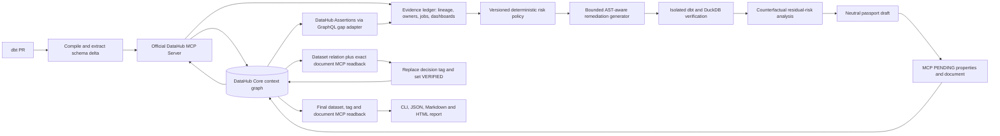

# Architecture

LineageGuard is a counterfactual change-control agent. It treats DataHub as
both the source of operational context and the durable record of the final
decision. Lineage, risk, test status, and write-back success come only from
recorded deterministic evidence.



## Closed-loop state machine

```text
INGEST_DIFF -> VERIFY_CATALOG_BASE -> RESOLVE_URNS -> TRACE_COLUMNS
-> ENRICH_ASSETS -> SCORE -> GENERATE_PATCH -> TEST_IN_TEMP_COPY
-> RESCORE_COUNTERFACTUAL -> WRITEBACK_PENDING -> READBACK
-> FINALIZE_WRITEBACK -> READBACK_VERIFY -> REPORT
```

Evidence-bearing inputs, MCP responses, verifier outputs, and final artifacts
are content-addressed. Ambiguous URN resolution, stale catalog state,
unavailable MCP, incomplete traversal, failed tests, or failed write-back leads
to an explicit non-pass state. Cached context may inform a report but cannot
prove a safe decision.

## Why this is not a dbt impact-comment clone

DataHub and Acryl already provide lineage impact tooling. LineageGuard's novel
loop is: understand the proposed future schema, trace heterogeneous consumers,
rank risk with contract and governance evidence, generate an executable
compatibility bridge, test it, rescore the remediated future, and persist the
verified change passport for later humans and agents.

## Contract representation in open-source DataHub

The demo seeds one native DataHub not-null Assertion definition and links
Assertion entities through a narrow GraphQL adapter. Version 0.1 does not seed
or score assertion run events. The documented `upsertDataContract` flow is
DataHub Cloud-specific, so it is deliberately not used as the foundation of
the open-source demo.

## Trust boundaries

- DataHub metadata is untrusted input and is never executed.
- Only allowlisted test commands run, in a temporary worktree, with timeouts.
- Generated patches may change only declared model and test paths.
- MCP mutations are disabled unless the run explicitly enters write-back mode.
- A successful local report is distinct from a verified DataHub write-back.
- Deterministic code remains authoritative for every decision and evidence
  state.
